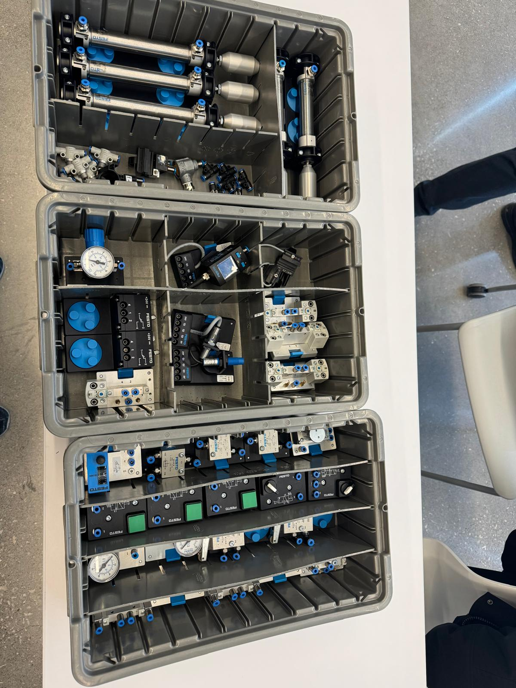

# Pneumatics, Electro-Pneumatics & MPS Troubleshooting

> Two semesters of Festo pneumatic and electro-pneumatic work — including timed presses, sensor-gated cylinders, and live troubleshooting on MPS stations under exam conditions.


This repo collects deliverables from **MEC355 — Mechatronics: Pneumatics and Hydraulic** and **MEC455 — Mechatronics Concepts** at Seneca Polytechnic. MEC355 covered pneumatic and electro-pneumatic circuit design with Festo equipment — directional valves, cylinders, regulators, sensors, and timed sequences. MEC455 carried that into integrated MPS (Modular Production System) station work, with a heavy focus on **live troubleshooting under exam conditions**.

---

## What's inside

### MEC355 — pneumatic + electro-pneumatic circuits

Built circuits for a series of process scenarios on the Festo training kit:

- **Timed press**: cylinder holds a part for a fixed time, then a second cylinder bends it. Single-acting + double-acting cylinders, 5/2 and 3/2 directional valves, timer relays.
- **Sensor-gated extend/retract**: cylinder moves only when the part is detected and the safety guard is closed
- **Sequencing with limit switches**: Cylinder A extends → cylinder B extends → both retract on signal, all coordinated by limit switches and electrical interlocks
- **Pressure-regulated subsystems**: independent pressure for clamping vs. ejection


*Festo training kit — cylinders, manifolds, valve terminals, regulators, indicators*

### MEC455 — MPS troubleshooting

Festo MPS stations (Distribution, Handling, Sorting, etc.) used as the troubleshooting target. The instructor's signature exercise: **secretly disconnect a wire, then ask us to identify the probable cause** of the malfunction. Forced a disciplined approach:

1. Observe what the system actually does vs. what it should do
2. Read live PLC tags — what input does the controller see? What output is it asserting?
3. Audit the wiring against the I/O diagram
4. Form hypotheses, test cheapest first
5. Confirm root cause, then fix

This is the exact loop you run in real commissioning. Practicing it on a familiar station with a single intentionally-introduced fault was the single most useful thing I did in those courses.

### Lab deliverables

| Lab | Focus |
| --- | --- |
| MEC455 L1 | Electronic Counter I |
| MEC455 L2 | Electronic Counter II |
| MEC455 L3 | Pressure Sensor |
| MEC455 — MPS | Stations Booklet (full troubleshooting reference) |

---

## Tech Stack

| Layer | Technology |
| --- | --- |
| **Vendor** | Festo — cylinders, valves, manifolds, sensors, MPS stations |
| **Cylinders** | Single-acting, double-acting, magnetic-piston (with reed sensors) |
| **Valves** | 3/2, 5/2, 5/3 — direct + pilot-operated |
| **Sensors** | Reed switches, capacitive, inductive, pressure |
| **Control** | Electrical with Siemens / Festo PLCs, electro-pneumatic conversion |
| **Sim** | FluidSim for circuit verification before bench-up |

---

## What I learned

- **Pneumatic logic is electrical logic in disguise.** Once you map cylinders to outputs and limit switches to inputs, the rest is the same Boolean algebra you'd use for relay logic.
- **Sequencing without sensors is a trap.** Time-based sequencing (extend for 2s, then retract) feels easier but breaks under load variation. Sensor-gated sequencing (extend until limit switch, then retract) is robust.
- **Pressure regulation is a design tool, not just a setting.** Different sub-circuits often want different pressures (high for clamping, low for ejection). Independent regulators per subsystem made circuits cleaner.
- **Troubleshooting is a discipline.** The instructor's "pull a wire" drill made me realize most of the time, the problem isn't where you'd guess. Reading the PLC tags first — before pulling wires myself — saved hours over a semester.
- **Festo's MPS stations are a great teaching tool.** They model the exact failure modes you see in production: sensor misalignment, sticky valves, intermittent connections, wrong I/O assignments.

---

## Repo contents

```
.
├── README.md
├── mec355-circuits/
│   ├── timed-press.md
│   ├── sensor-gated-cylinder.md
│   └── sequencing-with-limit-switches.md
├── mec455-mps/
│   ├── distribution-station.md
│   ├── sorting-station.md
│   ├── handling-station.md
│   └── troubleshooting-discipline.md
├── labs/                # MEC455 lab PDFs + MPS Stations Booklet
└── assets/
```

> 🔗 **Related**: the MPS work in TIA555 also lives in [siemens-tia-suite](https://github.com/harpreetsingh52004/siemens-tia-suite) — that's the *programming* side; this repo is the *troubleshooting and pneumatic-design* side. Different angle on the same equipment.

---

📫 **Harpreet Singh** — [harpreetsingh.cloud](https://harpreetsingh.cloud) · [GitHub](https://github.com/harpreetsingh52004)
